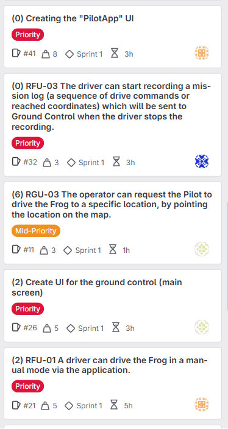

# Sprint 1 Review

**Project:** Team Building Challenge - "The Frog"  
**Sprint:** 1  
**Class-Group:** DHI1V.SP - Group 3 (Repo 02)  
**Date:** 05/15/2025  
**Scrum Master:** Kiarash Delavar

---

## Sprint 1 Summary

In Sprint 1, our team completed many important parts of the project. We built the main features of the PilotApp and
Ground Control, set up the database, and wrote useful documents like user stories and the Code of Conduct. We used
GitLab to track our work and collaborate as a team.

---

## What We Finished (Done)

**Here are the main tasks we completed in this sprint:**

- Built the Ground Control interface (main screen, CSV, and mission log)
- Completed the PilotApp design and functions
- Set up and tested the database
- Created wireframes and important documents (User Stories, Definition of Done, etc.)
- Built the Mission Log and 2D radar graph
- Tracked working hours and created team reports

**You can see our Sprint 1 tasks pictres in "Images" directory and also you can see here:**

---

## Who Did What (Team Contributions)

| Team Member | GitLab Color Tag | Main Tasks and Contributions                                                      |
|-------------|------------------|-----------------------------------------------------------------------------------|
| **Kiarash** | 🟧 Orange        | Scrum Master, PilotApp UI, Code of Conduct, RFU-01, RGU-04, writing documentation |
| **Kian**    | ⚫ Black          | Mission Log UI, user stories, CSV screen                                          |
| **Elham**   | 🟨 Yellow        | Ground Control UI, wireframes, map click feature                                  |
| **Emran**   | 🔴 Red           | Frog class, radar graph, bug fixing                                               |
| **Max**     | 🔵 Blue          | Mission Log, database setup, user stories                                         |

---

## What We Talked About

### What Went Well:

- We completed all planned tasks for Sprint 1
- Team communication got better with daily meetings
- GitLab helped us work together and stay organized
- We estimated task times well and worked efficiently
- The code was cleaner because we used smaller class files

### What Could Be Better:

- At first, some people worked on tasks without telling the team
- A few tasks were not clear enough
- Some team members had trouble using Git (merging, pushing, pulling)

### How We’ll Improve:

- Write clearer, more detailed task descriptions
- Practice Git skills (push, pull, merge, branches)
- Test work more before submitting

---

## Sprint 1 Stats

| Metric                 | Value                                      |
|------------------------|--------------------------------------------|
| Done Tasks & Weight    | 68 (total weight) , 21 tasks closed (Done) |
| Estimated Hours Worked | 50+ hours                                  |
| Team Members           | 5                                          |
| Sprint Length          | 2 weeks                                    |

---

## What’s Coming Next

- Finish writing all documents
- Fully test the app and make sure everything works well together
- Start Sprint 2 with a focus on fixing bugs and preparing for demos
- Keep improving how we communicate and plan as a team

---

_This Sprint 1 Review was completed by the team and presented and showed the demo of apps to the teacher
on **May 15, 2025**._
