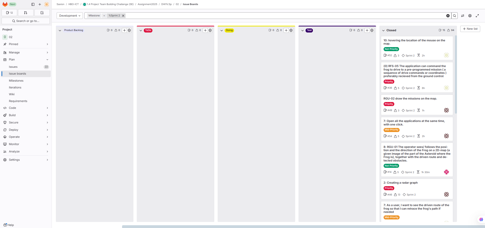
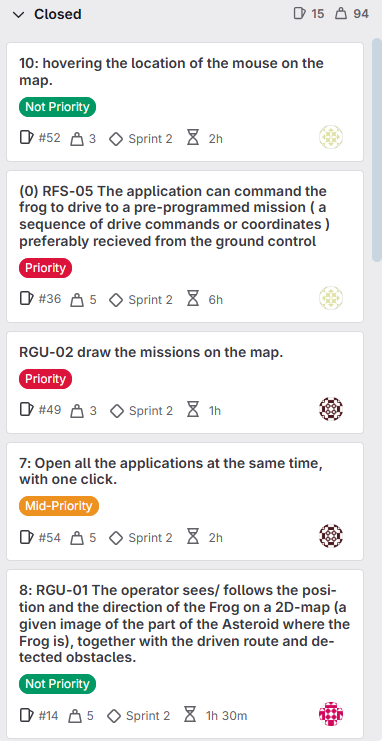
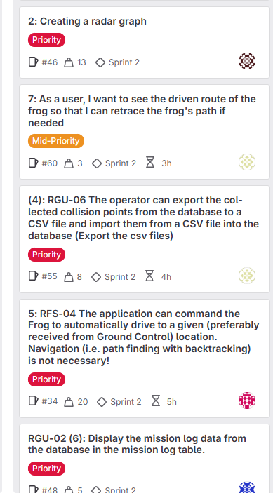
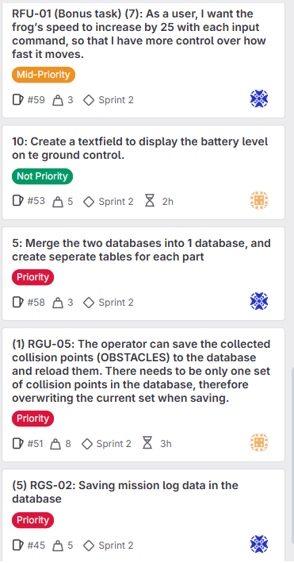

# Sprint 2 Review

**Project:** Team Building Challenge - "The Frog"  
**Sprint:** 2  
**Class-Group:** DHI1V.SP - Group 3 (Repo 02)  
**Date:** 05/30/2025  
**Scrum Master:** Kian Kamphuis

---

## Sprint 2 Summary

In Sprint 2, our team completed most of the functionality for the project. 

---

## What We Finished (Done)

**Here are the main tasks we completed in this sprint:**

- Finish the missionlog, save the missions in the database and draw the missions on the map.
- Completed the autodrive method.
- Save the obstacles to the database.
- Created the radar graph that draws the obstacles in a 2D-graph
- Create a export CSV files functionality. 
- Display some frog data like the battery, location and solar on the screen.
- Create function that opens all the apps at the same time.

**You can see our Sprint 2 tasks pictures in "Images" directory and also you can see here:**

---

## Who Did What (Team Contributions)

| Team Member | GitLab Color Tag | Main Tasks and Contributions                                                                                   |
|-------------|------------------|----------------------------------------------------------------------------------------------------------------|
| **Kiarash** | 🟧 Orange        | Save obstacles to the database, display the battery, solar information.                                        |
| **Kian**    | ⚫ Black          | Scrum master, Create a function that opens all three app at once, draw mission on the map, create radar graph. |
| **Elham**   | 🟨 Yellow        | Export CSV files, draw the route of the frog on the map, create autodrive for missions functionality.          |
| **Emran**   | 🔴 Red           | Finished the autodrive method, draw obstacles and frog on the map.                                             |
| **Max**     | 🔵 Blue          | save and display the mission data from the database on the screen, optimize the database.                      |

---

## What We Talked About

### What Went Well:

- We completed all planned tasks for Sprint 2
- Team communication got better with daily meetings
- We estimated task times well and worked efficiently
- The code was cleaner because we used smaller class files
- We balanced the weights of the tasks evenly and assigned the tasks correctly.

### What Could Be Better:

- Update your personal branches when there are new changes on main, to avoid merge conflicts as much as possible.
- Some task description were not clear enough, some of the where duplicate tasks

### How We’ll Improve:

- Write clearer, more detailed task descriptions
- Switch from personal branch to branch per task for better efficiency.

---

## Sprint 2 Stats

| Metric                 | Value                                      |
|------------------------|--------------------------------------------|
| Done Tasks & Weight    | 94 (total weight) , 15 tasks closed (Done) |
| Estimated Hours Worked | 50+ hours                                  |
| Team Members           | 5                                          |
| Sprint Length          | 2 weeks                                    |

---

## What’s Coming Next

- Finish writing all documents
- Fully test the app and make sure everything works well together
- Solve the bugs and finish the last tasks planned for sprint 3

---

_This Sprint 2 Review was completed by the team and presented and showed the demo of apps to the teacher
on **May 30, 2025**._
