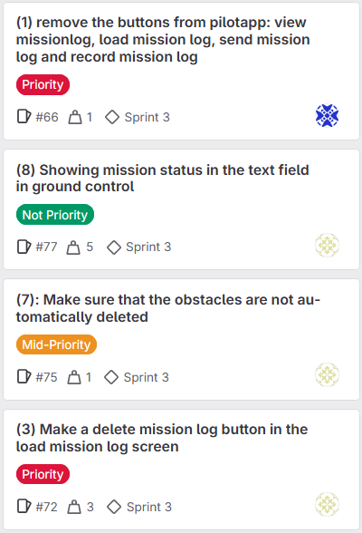

# Sprint 3 Review

**Project:** Team Building Challenge - "The Frog"  
**Sprint:** 3  
**Class-Group:** DHI1V.SP - Group 3 (Repo 02)  
**Date:** 12/6/2025  
**Scrum Master:** Max de Croon

---

## Sprint 2 Summary

In sprint 3, our team finalized the project and added the final documentation to the project.

---

## What We Finished (Done)

**Here are the main tasks we completed in this sprint:**

 - Create a new radargraph to fix the bugs
 - Implementing stop autodrive method
 - Removing a location from the sequence of locations the frog has to follow
 - Implementing target destination, current location and status in the groundcontrolapp
 - Showing mission status in the text field in ground control
 - Write a test plan and test report
 - Write down important classes and methods

**You can see our Sprint 3 tasks pictures in "Images of Sprint 3 board" directory and also you can see here:**

---

## Who Did What (Team Contributions)

| Team Member | GitLab Color Tag | Main Tasks and Contributions                                                                                        |
|-------------|------------------|---------------------------------------------------------------------------------------------------------------------|
| **Kiarash** | 🟧 Orange        | Implement target destination, current location and status in the GroundControlApp.                                  |
| **Kian**    | ⚫ Black          | Removing a location from sequence of locations that the frog has to follow.                                         |
| **Elham**   | 🟨 Yellow        | Showing mission status in the text field in ground control.                                                         |
| **Emran**   | 🔴 Red           | Writing down Important classes and changing the frog's position on the map from a circle to a triangle              |
| **Max**     | 🔵 Blue          | Create new radargraph and added the functionality to send a mission to the pilot and that the pilot can execute it. |

---

## What We Talked About

### What Went Well:

- We completed the project documentation wise and code wise.
- Team communication got better with daily meetings.
- We had a lot less gitLab issues than before.

### What Could Be Better:

- No points

### How We’ll Improve (For next project):

- Start splitting the code up earlier

---

## Sprint 2 Stats

| Metric                 | Value                                      |
|------------------------|--------------------------------------------|
| Done Tasks & Weight    | 91 (total weight) , 22 tasks closed (Done) |
| Estimated Hours Worked | 50+ hours                                  |
| Team Members           | 5                                          |
| Sprint Length          | 2 weeks                                    |

---

## What’s Coming Next

- Prepare for the assesment

---

_This Sprint 3 Review was completed by the team and we have to show the demo to the teacher
on **June 19, 2025**._
