#  Test Report

---

## RFU-01 – Manual Driving

**Step 1**: Launch The PilotApp.java.  
**Step 2**: Use direction buttons (↑, ↓, ←, →).  
**Step 3**: Observe Frog movement on the radar map.  

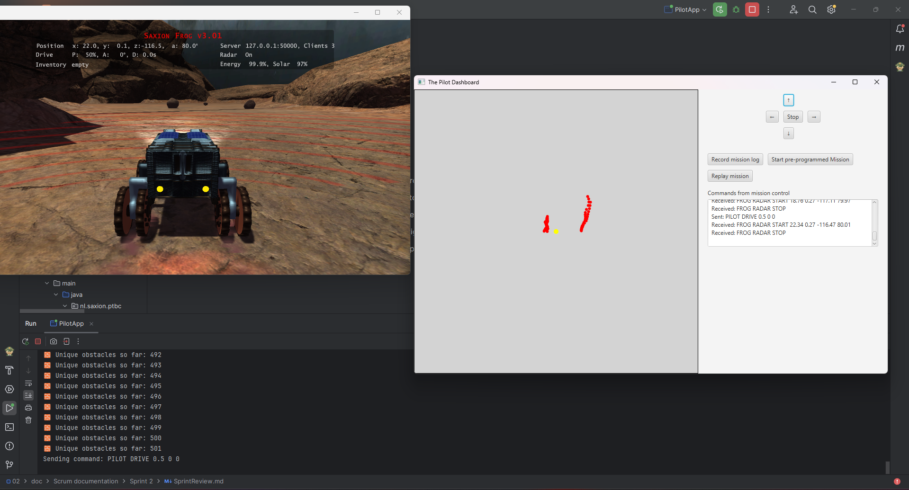

**Result**: ✅ Success – Manual movement worked as expected.

---

## RFU-02 – View Radar Points on Map

**Step 1**: Launch ThePilot (then see the Ground Control app).  
**Step 2**: Wait for connection.  
**Step 3**: Yellow dots (obstacles) appear on the map. 

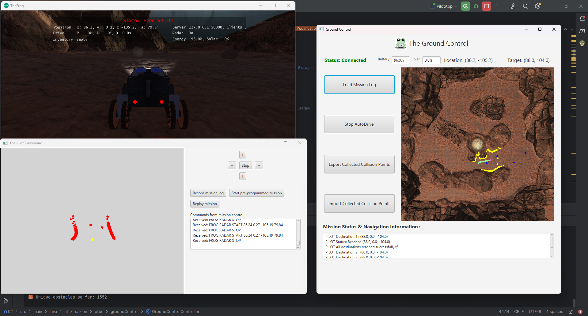
**Step 4**: Move the Frog to see new yellow dots. 

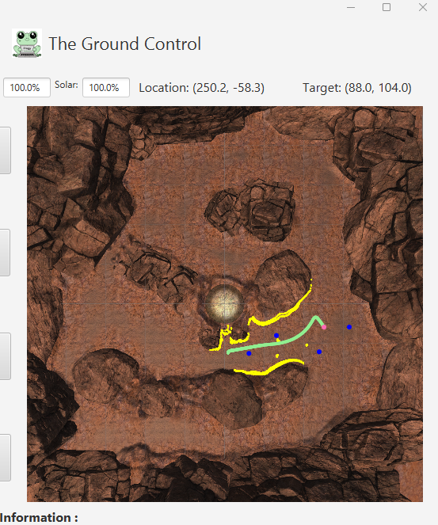

**Result**: ✅ Success – Radar points updated live.

---

## RFU-03 – Record Mission Log

**Step 1**: Run the PilotApp.  
**Step 2**: Press the "Record mission log" button and send manual commands.  

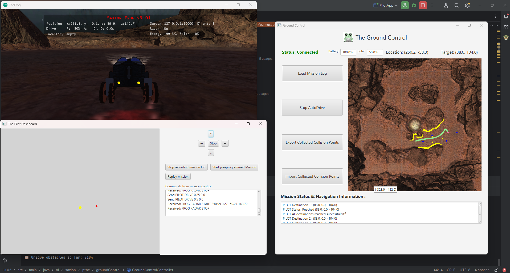

**Step 3**: After recording, open the Ground Control app and check the Load Mission Log table.  

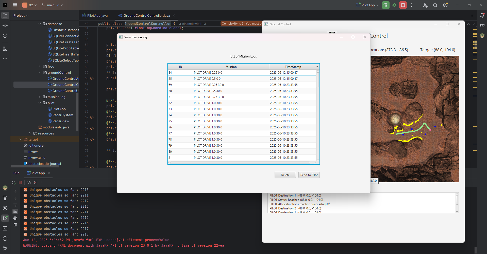

**Step 4**: Verify the mission appears in the table.  
**Step 5**: (Optional) Open `sasa.db` or run `SQLiteSelectTable` to inspect data.  

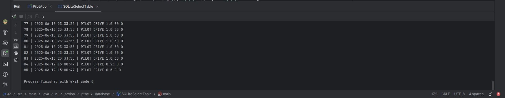

**Result**: ✅ Success – Mission commands were correctly recorded and stored.

---

## RFS-03 – Send Frog Position and Obstacles

**Step 1**: Open the Pilot app.  
**Step 2**: Open the Ground Control app.  
**Step 3**: Observe position and obstacle data in the "Mission Status & Navigation Information" section.  
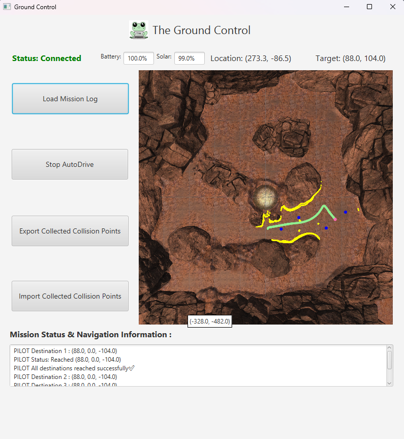

**Result**: ✅ Success – Position and obstacle data displayed correctly.

---

## RFS-04 – Auto Drive to Location

**Step 1**: Open the Pilot app.  
**Step 2**: Open the Ground Control app.  
**Step 3**: Click a destination point on the map.  
**Step 4**: Watch the Frog drive to and stop at the selected destination (Red Point).  

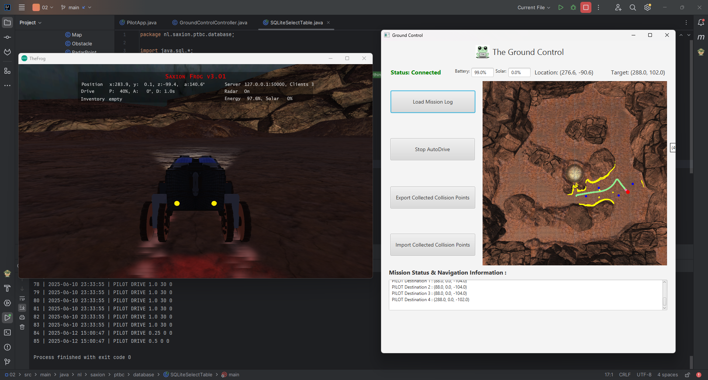

**Result**: ✅ Success – Auto-drive performed accurately.

---

## RGU-01 – Display Frog Position and Route

**Step 1**: Open the Pilot app.  
**Step 2**: Launch Ground Control.  
**Step 3**: Drive the Frog manually or automatically.  
**Step 4**: Observe real-time updates of Frog's position and direction.  

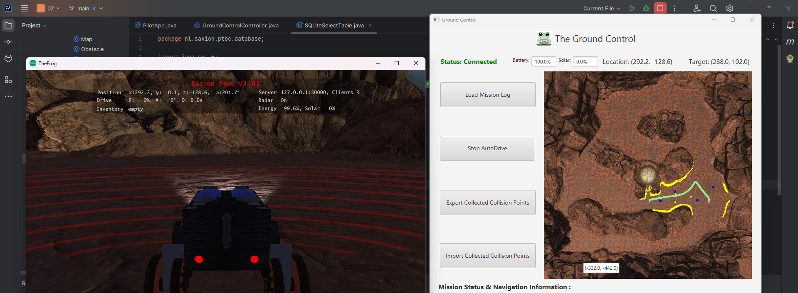

**Result**: ✅ Success – Frog position and driven path shown on the map.

---

## RGU-02 – Display Mission Log Table from Database

**Step 1**: Launch Ground Control with an empty database — mission log table is empty.  
**Step 2**: Launch Pilot and record a mission log using manual controls.  

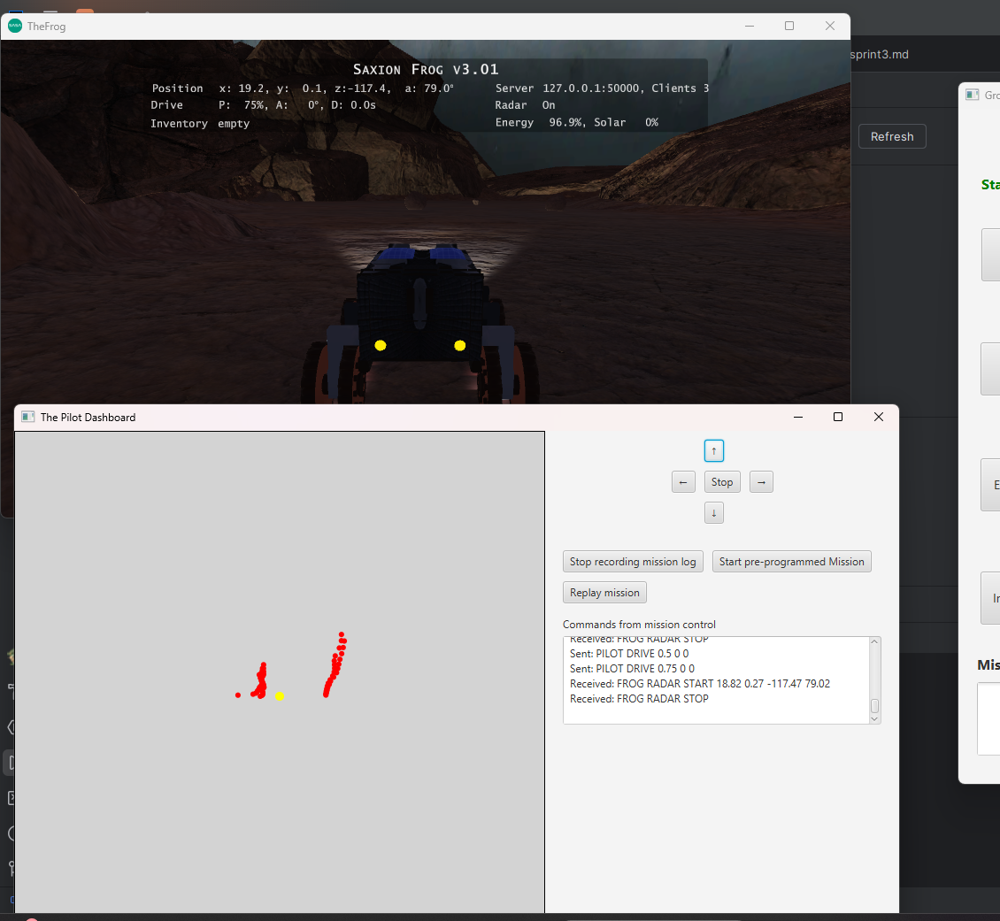

**Step 3**: Stop recording and return to Ground Control.  
**Step 4**: Load mission logs and observe the entry in the table.  

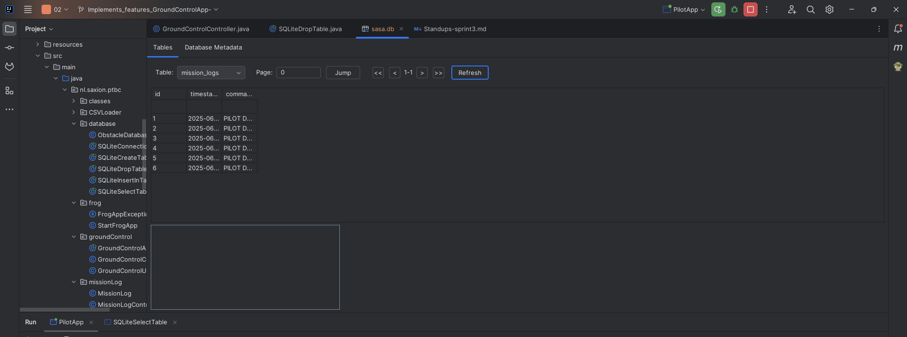

**Step 5**: Add another mission and reload — confirm both logs appear.  

**Result**: ✅ Success – Ground Control correctly loads and displays mission logs from the database.

---

## RGU-03 – Operator Requests Location Drive

**Step 1**: Start all three apps: Frog, Pilot, and Ground Control.  
**Step 2**: Click on a valid map point in Ground Control.  
**Step 3**: Observe the Frog navigate toward the selected location.  

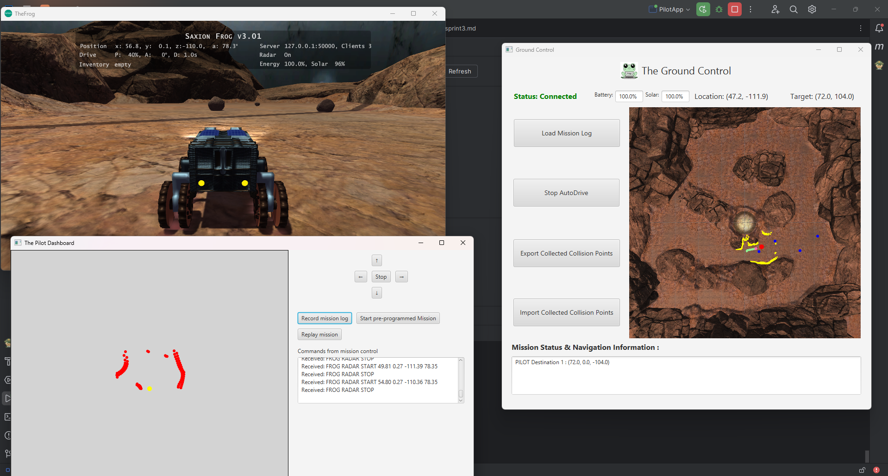

**Result**: ✅ Success – Frog responded to operator location request.

---

## RGU-04 – Send and Replay Mission Log from Database

**Step 1**: Start the Frog, Pilot, and Ground Control apps.  
**Step 2**: Record a mission using the Pilot and save it.  
**Step 3**: Load the mission log table in Ground Control.

**Step 4**: Select a mission log row and send to Pilot.
**Step 5**: Press "Replay Mission" in the Pilot app.  

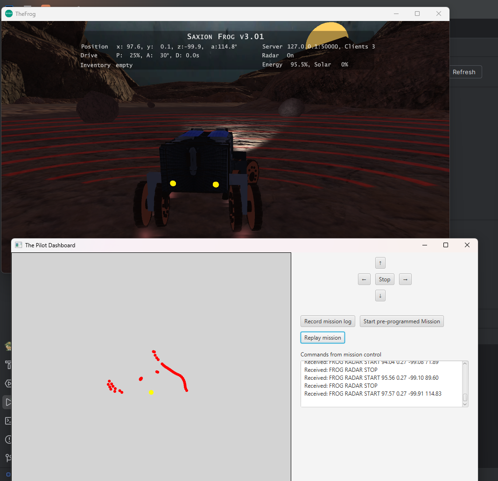

**Step 6**: Observe the Frog executing the replayed mission.  

**Result**: ✅ Success – Mission was successfully sent and replayed.

---

## RFS-05 – Drive Pre-Programmed Mission

**Step 1**: Open Frog, Pilot, and Ground Control apps.  
**Step 2**: Create or use an existing mission log.  
**Step 3**: Click the **"Start Pre-Programmed Mission"** button in the Pilot app.  
**Step 4**: Observe the Frog automatically drive through blue dots in sequence.  

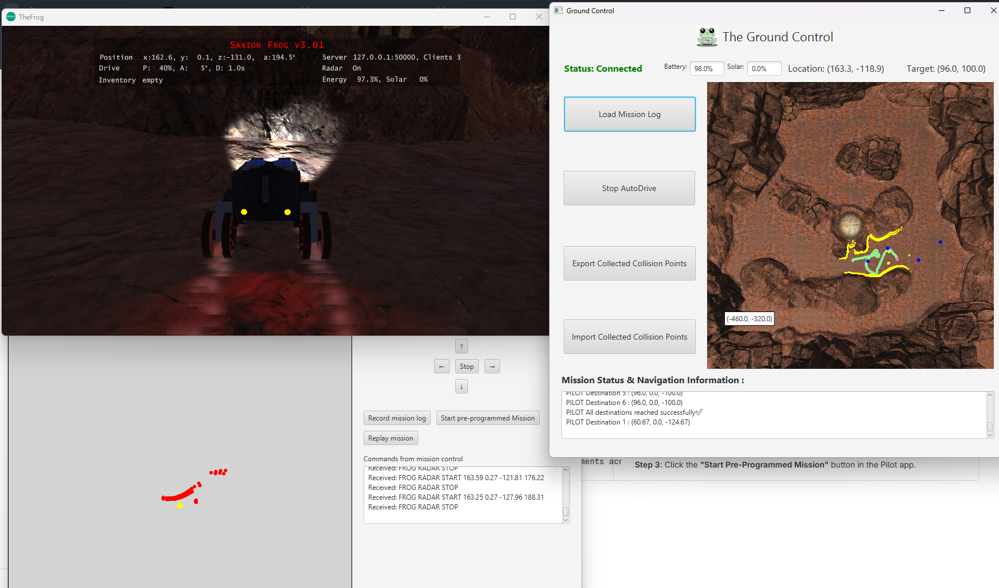

**Result**: ✅ Success – Pre-programmed mission executed correctly.

---

## RGS-01 – JavaFX as GUI Framework

**Step 1**: Open project source code and inspect UI components.  

**Result**: ✅ Success – JavaFX is used for all GUI elements across apps.

---

## RGS-02 – Saving Mission Log Data in the Database

**Step 1**: Launch the Pilot app.  
**Step 2**: Press "Record mission log", perform manual driving.  
**Step 3**: Stop the log to trigger saving.  
**Step 4**: Open `sasa.db` or use SQLite viewer to confirm the data is saved with correct timestamps.  
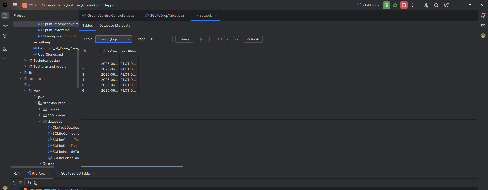

**Step 5**: Repeat the process and confirm logs don’t duplicate.  

**Result**: ✅ Success – Logs were saved without errors or duplicates.

---

## RGU-05 – Save and Reload Collision Points to Database

**Step 1**: Move the Frog to detect obstacles.  
**Step 2**: Close apps (except frog.exe) to trigger save to database.  
**Step 3**: Inspect the `Obstacles` table in `sasa.db`.  
**Step 4**: Confirm one set of points is saved; repeat with different data to overwrite.  
**Step 5**: Edge test: Save with no points or force close — no crashes should occur.  

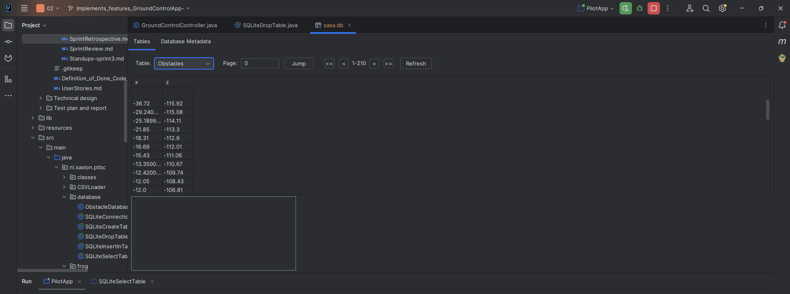

**Result**: ✅ Success – Collision data saved and updated safely.

---

## RGU-06 – Export Collision Points to CSV

**Step 1**: Move the Frog to collect collision points.  
**Step 2**: Click "Export Collision Points" in Ground Control.  

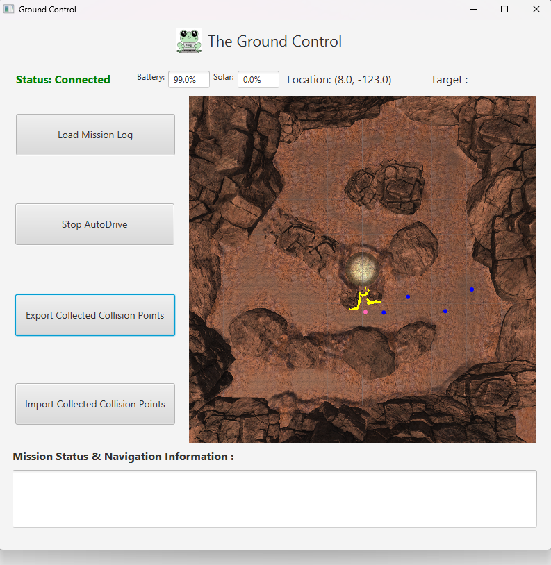

**Step 3**: Choose file path in dialog and confirm.  

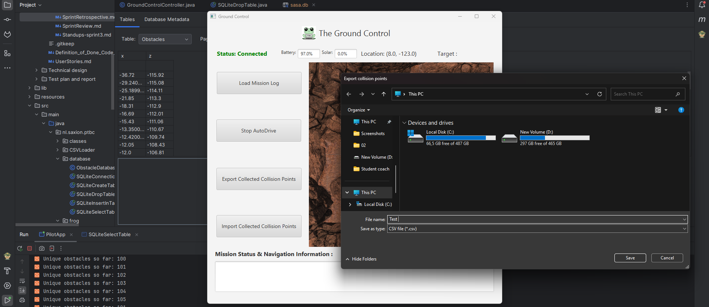

**Step 4**: Confirm that a CSV file 

with obstacle data is created.  

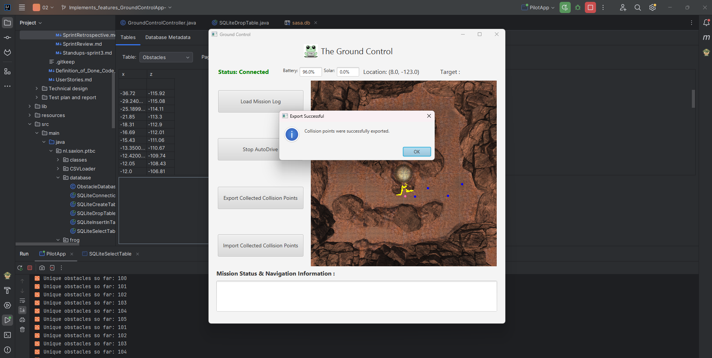

**Step 5**: Try exporting with missing apps (e.g., Frog not running) — verify no crash.  

**Result**: ✅ Success – CSV exported, system handled all scenarios properly.

